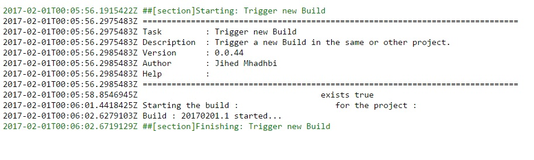

# Trigger New Build
This extension allow the user to trigger a new build in the same  or in other project. A typical use case is when you want to deploy a new version of the app B in the end of successful deployment of app A in production.

The task use VSTS / TFS api to get the list of projects, list of build definitions and to trigger the new build.
# Get Started

1- You need to create a token with the following scopes :

[How to create your token](https://www.visualstudio.com/en-us/docs/setup-admin/team-services/use-personal-access-tokens-to-authenticate)

2- Then, you need to create an endPoint of type "Build Api Access" :

3- Specify a connection name, your VSTS/TFS server url and the token that you created in step 1 :

4- You will find the new task in the build section :

5- Configure your task by choosing the endPoint that you created in step 2, choose a collection (For VSTS it will be the default value : "DefaultCollection". For TFS you can choose your own collection if it's different) choose a project and a build definition.

6- In log of the release, you can see that the build that you choose was started.

## Release Notes

> **02/2017**
> - Initial version (preview)
